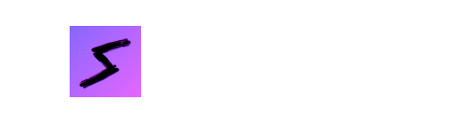
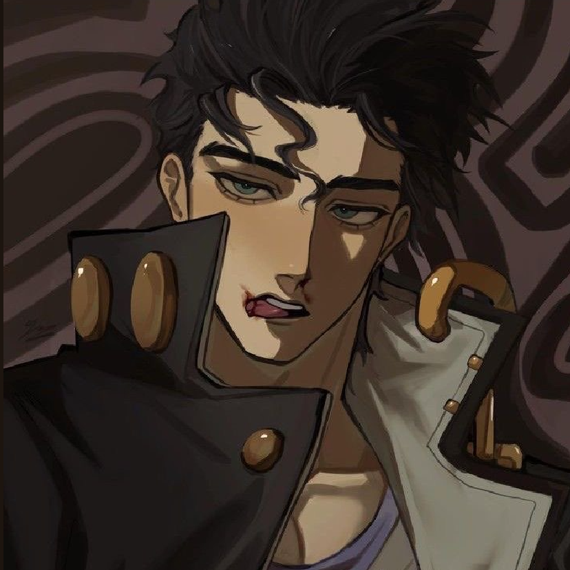
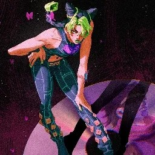

<h1 align="center">
    
</h1>

<p align="center">
  <i align="center">An Open Source Discord Bot - Fully Customisable and Free✨</i>
</p>

<h4 align="center">
  <a>
    
  </a>
  <a>
    
  </a>
  <a>
    
  </a>
  <a>
    
  </a>
</h4>

<h4 align="center">
  
</h4>

<p align="center">
  <a href="#overview">Overview</a> •
  <a href="#features">Features</a> •
  <a href="#installation">Installation</a> •
  <a href="#contributors">Contributors</a> •
  <a href="#special-thanks">Special Thanks</a> •
  <a href="#license">License</a>
</p>

## Overview

**SnapBot** is currently in development with the goal of becoming a multi-purpose Discord bot packed with features to enhance "The Attic" server's experience. While initially tailored for "The Attic," **SnapBot** is open-source, allowing anyone to freely modify the source code and use it for their own server.

## Features

**SnapBot** currently has only a few commands which can be used to interact with the bot. However, **SnapBot** is planned to include features such as music playback, games, utility commands, and more.

## Installation

### Requirements

- Python 3.8 or higher

- A MongoDB Cluster [ This is important because SnapBot uses MongoDB as it's database ]

```bash
# Clone the repository
git clone https://github.com/kish7105/SnapBot.git
cd SnapBot

# Create a virtual environment
python -m venv venv

# Activate the virtual environment( For Windows )
venv\Scripts\activate

# Activate the virtual environment( For MacOS & Linux )
source venv/bin/activate

# Install the required dependencies
pip install -r requirements.txt
```

## Contributors

<a href="https://github.com/kish7105/SnapBot/graphs/contributors">
  
</a>

## Special Thanks

A heartfelt thank you to the amazing members of [The Attic](https://discord.gg/attic) Discord server. Your support and encouragement have been invaluable to the success of this project. Whether through sharing insights, providing feedback, or simply being a sounding board, you've made a significant difference.

### To Each of You

Every one of you has contributed uniquely to this journey, and I couldn't have come this far without you. Your presence and contributions remind us of the power of community and collaboration.

Thank you for being a part of this incredible journey. Your support is deeply appreciated, and I look forward to many more milestones together💖

<table>
  <tr>
    <td align="center">
      
      <br />
      <sub><b>Dance</b></sub>
    </td>
    <td align="center">
      
      <br />
      <sub><b>Shuu</b></sub>
    </td>
    <td align="center">
      
      <br />
      <sub><b>Riverrr</b></sub>
    </td>
    <td align="center">
      
      <br />
      <sub><b>Amen</b></sub>
    </td>
    <td align="center">
      
      <br />
      <sub><b>Muteki</b></sub>
    </td>
  </tr>
  <tr>
    <td align="center">
      
      <br />
      <sub><b>aayu</b></sub>
    </td>
    <td align="center">
      
      <br />
      <sub><b>Eve</b></sub>
    </td>
    <td align="center">
      
      <br />
      <sub><b>Home</b></sub>
    </td>
    <td align="center">
      
      <br />
      <sub><b>Baaka</b></sub>
    </td>
    <td align="center">
      
      <br />
      <sub><b>Manno</b></sub>
    </td>
  </tr>
  <tr>
    <td align="center">
      
      <br />
      <sub><b>Mr. Jelly</b></sub>
    </td>
  </td>
</table>
  

## License

Check out the [LICENSE](./LICENSE) file for more details.

## Made with 💖 By
<table>
  <tr>
    <td align="center">
      
      <br />
      <sub><b>kishh</b></sub>
    </td>
  </tr>
</table>

---

